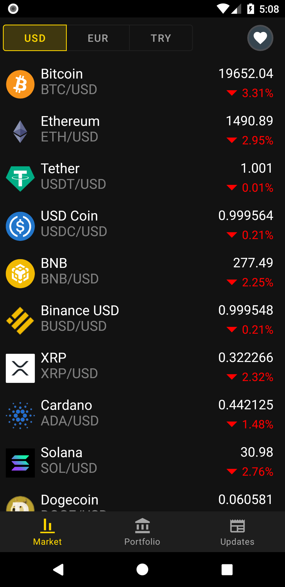
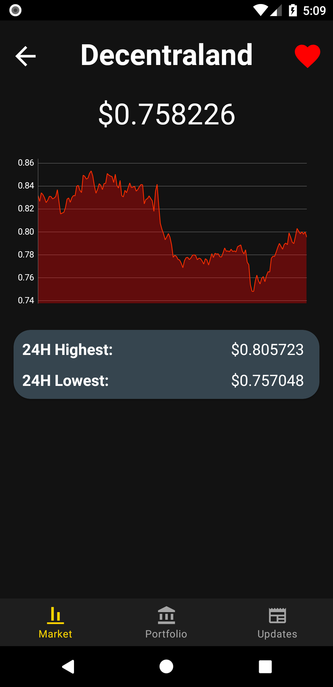
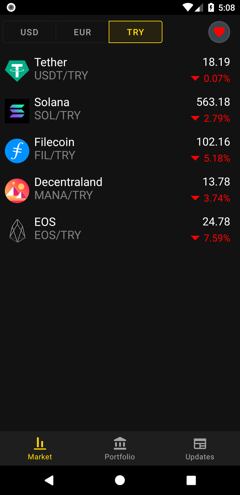

# CurrencyListerX
Track your favorite cryptocurrencies and keep up with latest news.

## Tech Stack
- MVVM
- Base class
- Hilt for dependency injection
- Navigation Component (with Safe Args plugin)
- Timber ([link](https://github.com/JakeWharton/timber))
- Retrofit ([link](https://github.com/square/retrofit))
- Gson ([link](https://github.com/google/gson))
- Coroutines
- Glide ([link](https://github.com/bumptech/glide))
- RSS-Parser ([link](https://github.com/prof18/RSS-Parser))
- MPAndroidChart ([link](https://github.com/PhilJay/MPAndroidChart))

## Screenshots
| Coin List | Coin Details |
| --------- | ------------ |
|||

| Favorited Coins | Cryptocurrency News |
| --------------- | ------------------- |
|||

## Credits
Market data provided by [CoinGecko](https://www.coingecko.com/en/api)

News RSS of [Cointelegraph](https://cointelegraph.com/rss-feeds), [CoinDesk](https://www.coindesk.com/), [CoinJournal](https://coinjournal.net/feeds/),
